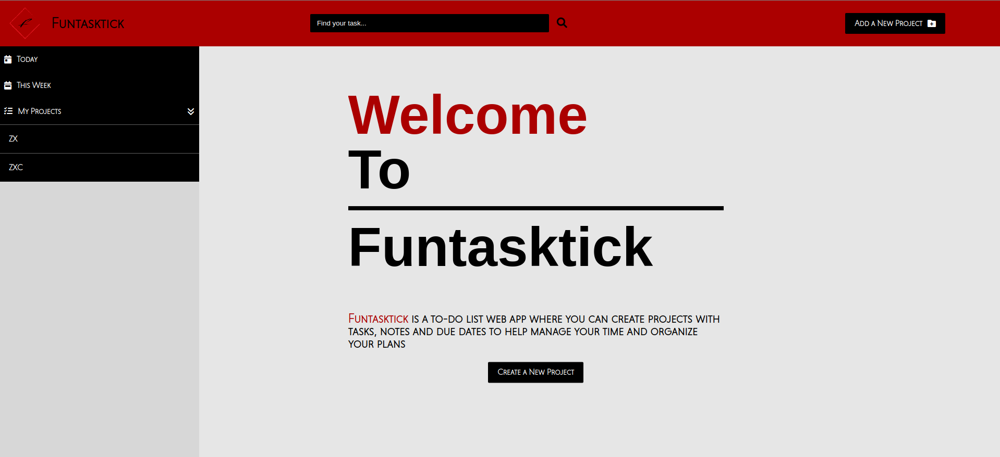

# Funtasktick

> Todo list single page web application

## Table of contents

- [Overview](#overview)
  - [Features](#features)
  - [Screenshot](#screenshot)
  - [Links](#links)
- [My process](#my-process)
  - [Built with](#built-with)
- [Author](#author)

## Overview

### Features

- [x] Create separate projects with a fill in form
- [x] Projects contain a title, description, due date and importance
- [x] Tasks inside projects may or may not contain due dates and deleting capabilities
- [x] Every project has editable notes 
- [x] A functioning search bar to find your tasks without scrolling through projects
- [x] Today tasks tab to display tasks dated the current day
- [x] This week tasks tab to display tasks dated the current week
- [x] Extensive use of date-fns to format date content
- [x] Webpack and npm to bundle the JS files into main.js
- [x] Fully Responsive

### Screenshot

### Links

> View the project [here](https://funkosaur.github.io/Funtasktick/)

## My process

### Built with

- HTML5
- CSS
- Flexbox
- CSS Grid
- Javascript
- ES6
- date-fns
- Webpack

## Author

- Website - [Mario Boykovski](https://github.com/funkosaur)